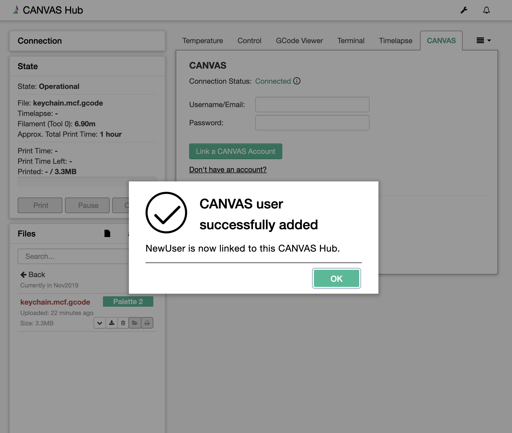
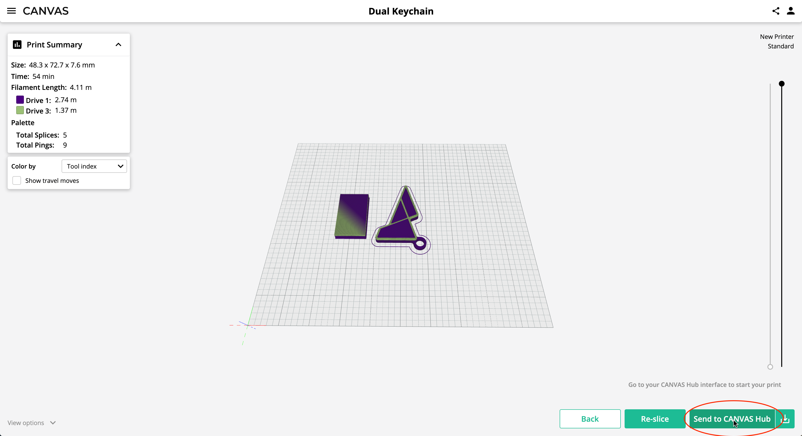
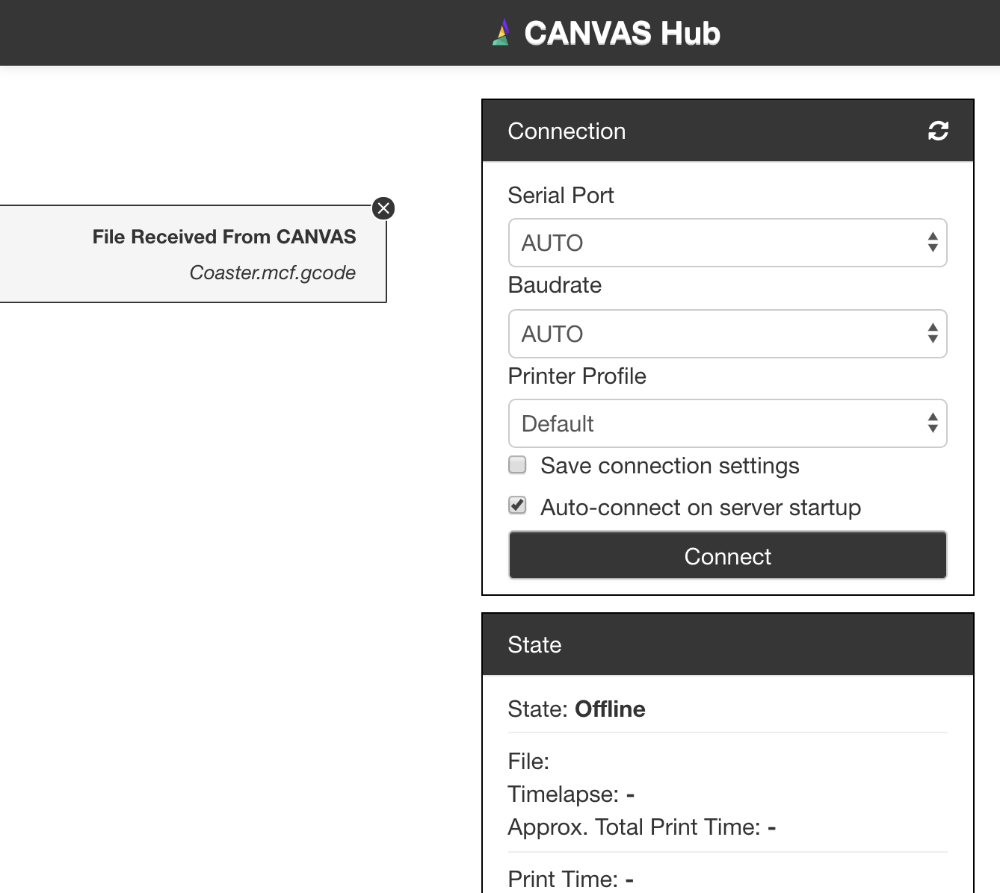

# CANVAS PLUGIN

This OctoPrint plugin enables connection and communication between OctoPrint and [CANVAS](https://canvas3d.io/).

## Installing

On your OctoPrint server, manually install this plugin via the Plugin Manager using the following URL:

`https://gitlab.com/mosaic-mfg/canvas-plugin/-/archive/master/canvas-plugin-master.zip`

## Functionalities

### 1. Connect CANVAS accounts to OctoPrint

### 2. Send files from CANVAS...

### 3. To OctoPrint

## Authors

[Mosaic Manufacturing Ltd.](https://www.mosaicmfg.com/)

## License

This project is licensed under Creative Commons Public Licenses - see the [LICENSE](https://gitlab.com/mosaic-mfg/canvas-plugin/blob/master/LICENSE) file for more details.
